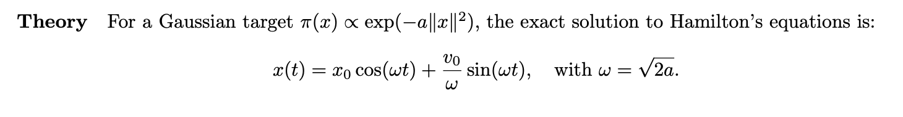
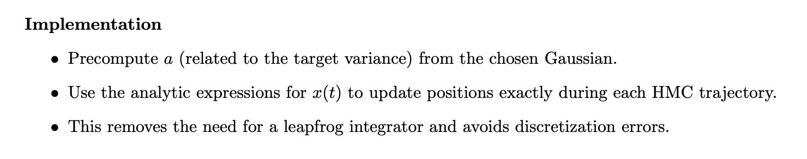
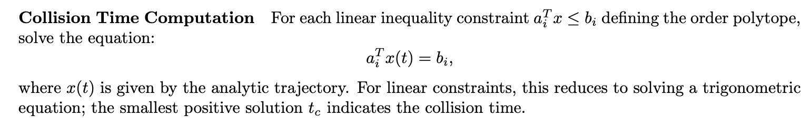
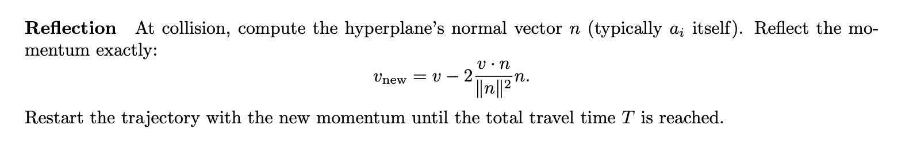

## Proposal-Optimizing Exact Hamiltonian Monte Carlo for Order Polytopes

### Goal

Develop an optimized Exact Hamiltonian Monte Carlo (HMC) sampler with a Gaussian target distribution, adapted specifically for order polytopes. The primary application is to efficiently estimate the volume of order polytopes and count linear extensions.

---

### Background

- **Challenge:**  
  Traditional methods (e.g., ARMC, HAR) may become inefficient or slow to mix in high-dimensional settings. Optimizing sampling in this structured space is essential.

---

### References

- **[10] Hamiltonian Monte Carlo with Boundary Reflections:**  
  Introduces HMC with reflections at the boundaries of a bounded domain. By reflecting elastically on the hyperplane constraints, the sampler avoids the need for rejection steps and can traverse high-dimensional polytopes more rapidly.

- **[11] Exact HMC for Truncated Multivariate Gaussians:**  
  Exploits the fact that for Gaussian targets the Hamiltonian equations are exactly solvable (they reduce to harmonic oscillator equations). This allows:
  - Analytical integration of trajectories (no numerical integration errors).
  - Exact computation of collision times with boundaries.
  - Guaranteed energy conservation, leading to high acceptance.

---

### Proposed Optimization and Implementation Details

#### 1. Use Analytic Trajectories

#### 2. Efficient Boundary Handling via Exact Collision Detection and Reflection

#### 3. Uniform Distribution Approximation via Gaussian Smoothing
- **Motivation:**  
  - The volume of the order polytope corresponds to the integral of the uniform distribution over \(P\).
- **Approach:**  
  - Approximate the uniform density by a Gaussian with a very small quadratic term (i.e., low “a” value) so that the Gaussian is nearly flat over \(P\).
  - Run the exact HMC sampler using this Gaussian target.
  - Apply appropriate reweighting to obtain estimates for the uniform case.

#### 4. Preprocessing Optimizations
- **Structured Matrix Operations:**  
  - Order polytopes have structured constraints (e.g., derived from a poset). Precompute elements like the normal vectors of the hyperplanes and store them for repeated use.
  - Reuse and cache common matrix operations (such as factorizing constant matrices) to speed up the collision time computations.

#### 5. Robust and Efficient Implementation
- **Robustness:**  
  - Utilize multi-precision interval arithmetic (e.g., via iRRAM) to handle degenerate cases or near-boundary conditions.
  - Ensure that all geometric predicates (such as checking if a point lies inside \(P\)) are computed robustly to prevent numerical instability.
- **Efficiency:**  
  - Parallelize independent operations, such as computing collision times for multiple constraints.

---

### Advantages of using HMC

- **No Discretization Error:**  
  Exact integration of trajectories eliminates numerical integration error.
- **High Acceptance:**  
  Energy conservation guarantees that proposals are always accepted.
- **High-Dimensional Efficiency:**  
  Tailored boundary handling and exploitation of structure lead to faster mixing and lower runtime in high-dimensional order polytopes.
- **Robustness:**  
  Multi-precision arithmetic ensures correct behavior even in degenerate cases.

---

### Evaluation Plan

- **Compare Runtime and Accuracy:**  
  Benchmark against current Volesti methods (e.g., CB/SOB with SVD rounding) and the ARMC algorithm from the count-linear-extensions repository.
- **Test on Various Instances:**  
  Evaluate on standard order polytope instances (e.g., 50D, 100D) and synthetic posets with known linear extension counts.
- **Robustness Testing:**  
  Perform multiple runs and analyze stability under different conditions (e.g., different cooling schedules, travel times, and starting points).

---

### Deliverables

- A new C++ class/module in Volesti implementing:
  - Exact HMC with Gaussian target tailored for order polytopes.
  - Efficient boundary reflection handling for \(Ax \le b\) constraints.
- Integration with the existing volume estimation interface.
- Comprehensive documentation and example scripts.

resource: https://sbl.inria.fr/doc/Hamiltonian_Monte_Carlo-user-manual.html#sec-HMC-cpp-design-main-components

